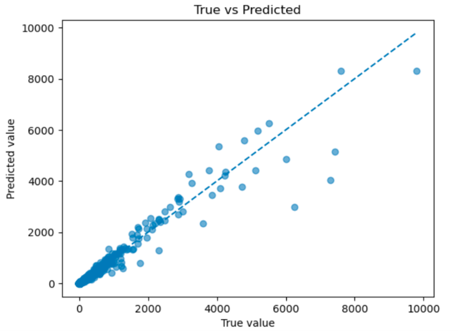

## Background

In marine engineering and naval architecture, accurately predicting hydrodynamic forces (such as drag, lift, and torque) on submerged objects like ship hulls, underwater vehicles, or offshore structures is crucial for design optimization, performance evaluation, and real-time control systems. Traditional methods rely on computational fluid dynamics (CFD) simulations, which are computationally intensive and time-consuming, often requiring hours or days for a single high-fidelity simulation. Experimental data from wind tunnels or water tanks is limited in scale and expensive to acquire. To address these chal- lenges, deep neural networks (DNNs) can serve as surrogate models to approximate these forces rapidly, but they require vast amounts of training data to capture the complex, nonlinear interactions in fluid flows.

<!--more-->

## Objectives

Develop a deep neural network architecture to predict hydrodynamic forces on a parameterized family of submerged objects (e.g., ellipsoidal shapes representing simplified submarine hulls) under varying flow conditions. The model should be trained on a synthetically generated dataset consisting of at least 1 million samples to ensure robustness and generalization across a wide parameter space. The solution must emphasize efficiency in data generation, model training, and inference to make it practical for iterative design processes.

## Computational Environment

The model is trained on a GPU-enabled system with the following configuration:
- CUDA Version: 12.6
- cuDNN Version: 8.9.7
- GPU: NVIDIA A16
- Framework: PyTorch (with torch.compile optimization)

## Results

The true-versus-predicted curve demonstrates excellent agreement between the model predictions and the reference data, indicating strong predictive accuracy of the trained model.

